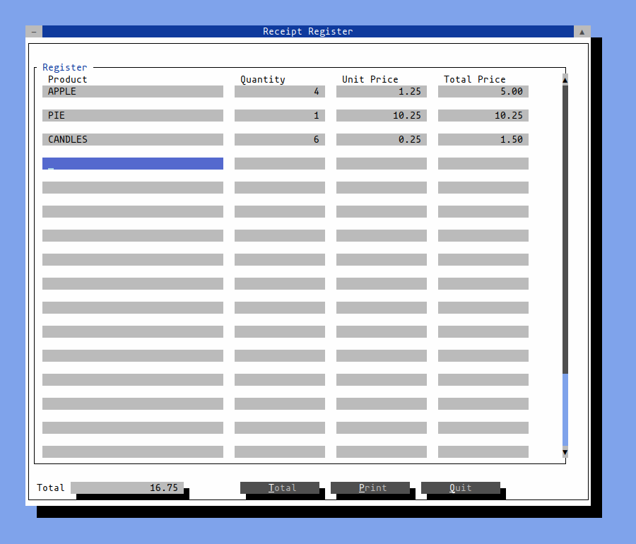

# Receipt Maker
Created by Wim Stockman on 2022-12-14 wim@thinkerwim.org

Little Demo Applicition created to test the [FINAL CUT TOOLKIT](https://github.com/gansm/finalcut) for creating [text-based user interface](https://en.wikipedia.org/wiki/Text-based_user_interface). 
and also integrating the power of [GROFF typesetting system](https://www.gnu.org/software/groff/) to generate postscript and pdf receipts with variable length


## Installation
```bash
> git clone https://github.com/wimstockman/receipt_demo
> cd receipt_demo
> make
> ./receipt_demo
```

## Supported Platform

* Linux

## Please send comments to

https://github.com/wimstockman/receipt_demo/issues
